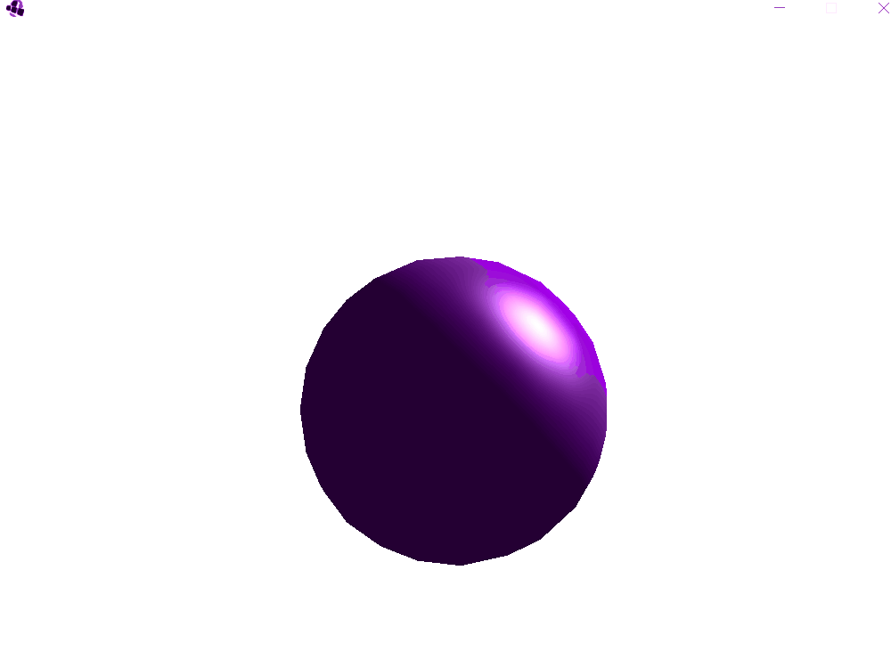
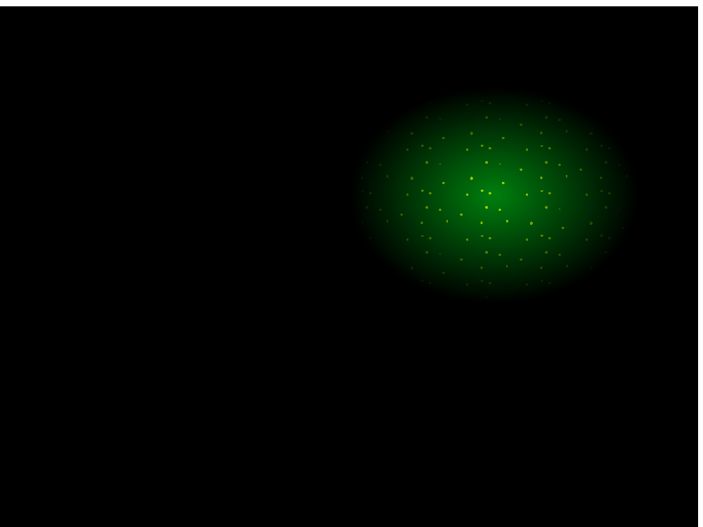
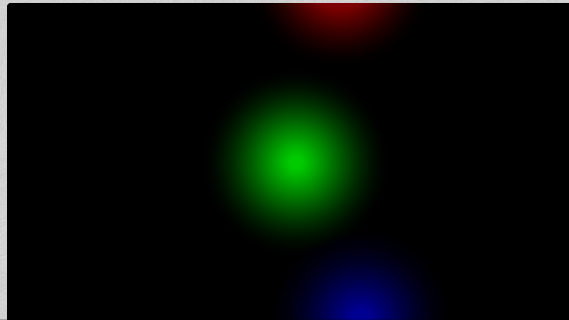
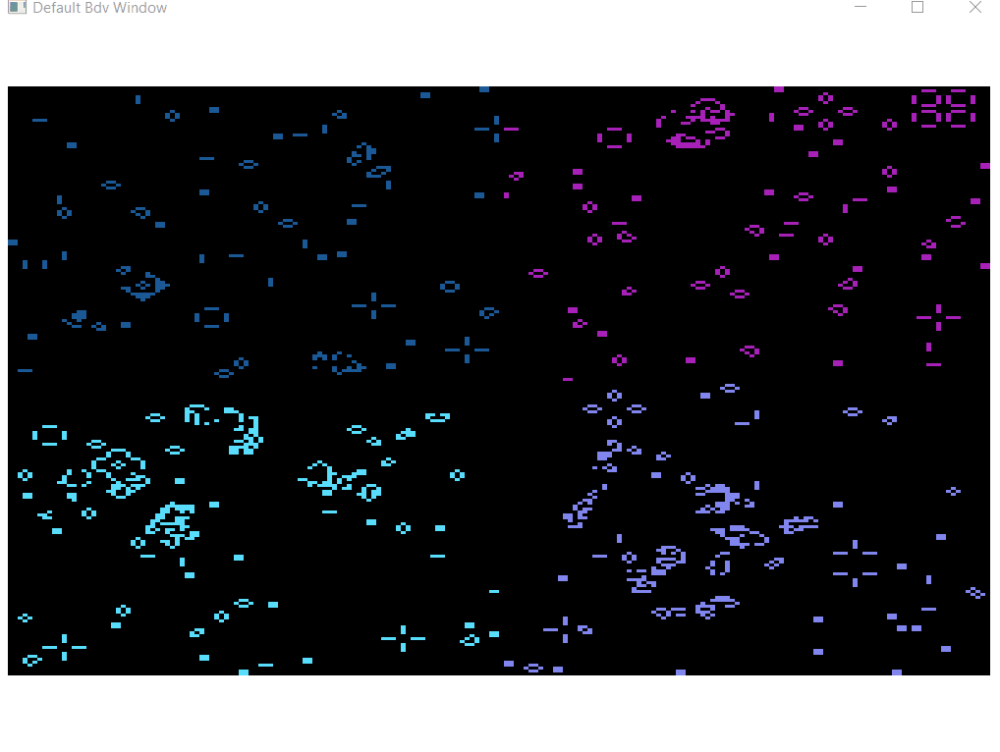
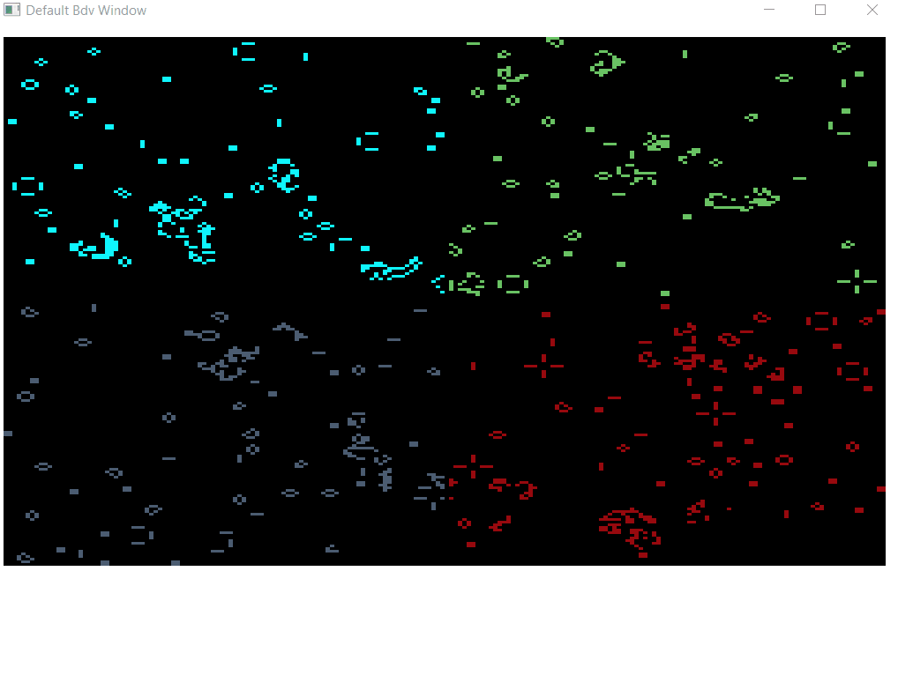
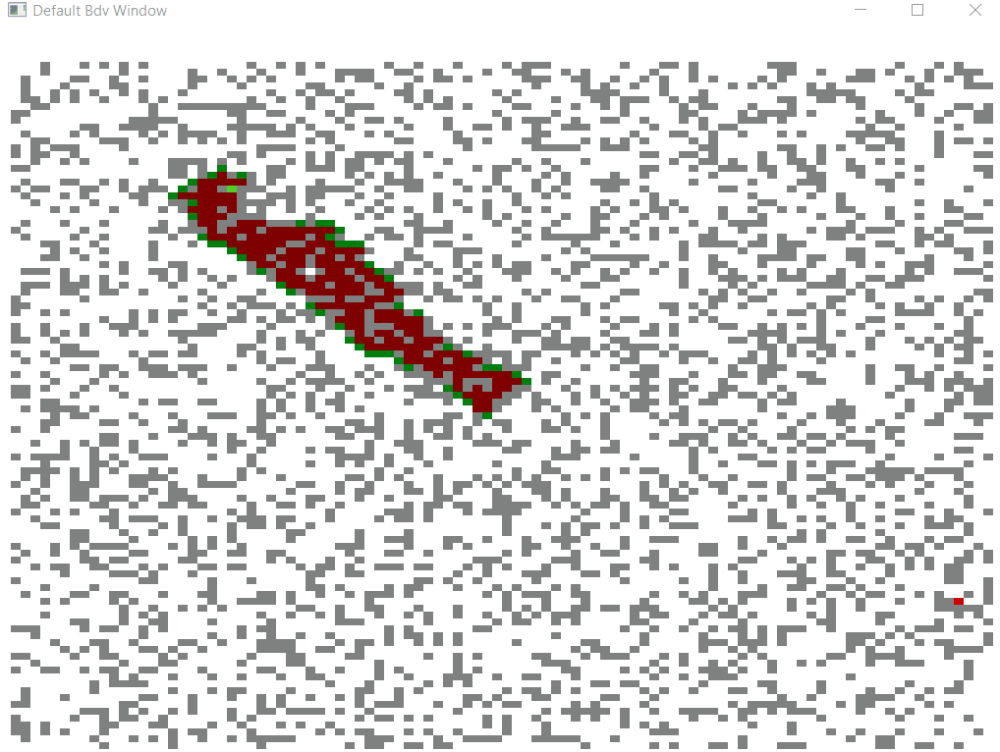
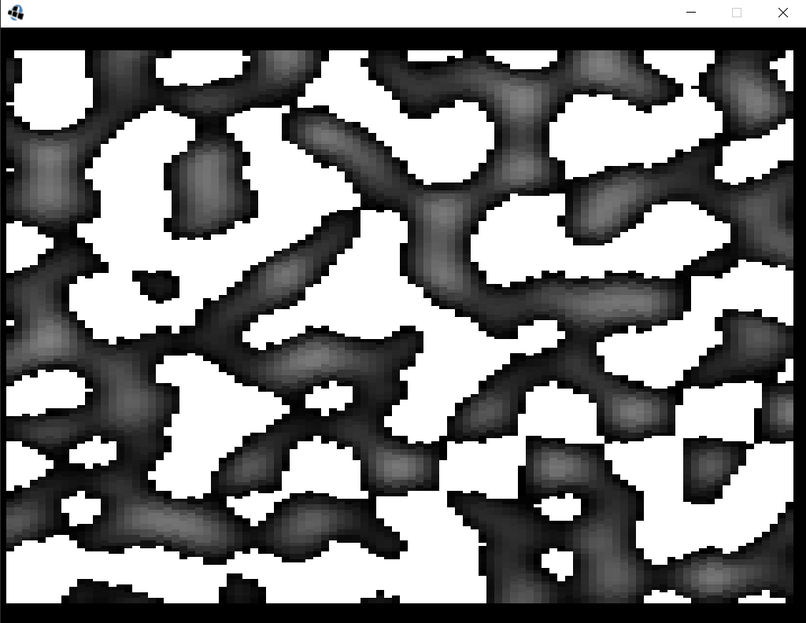
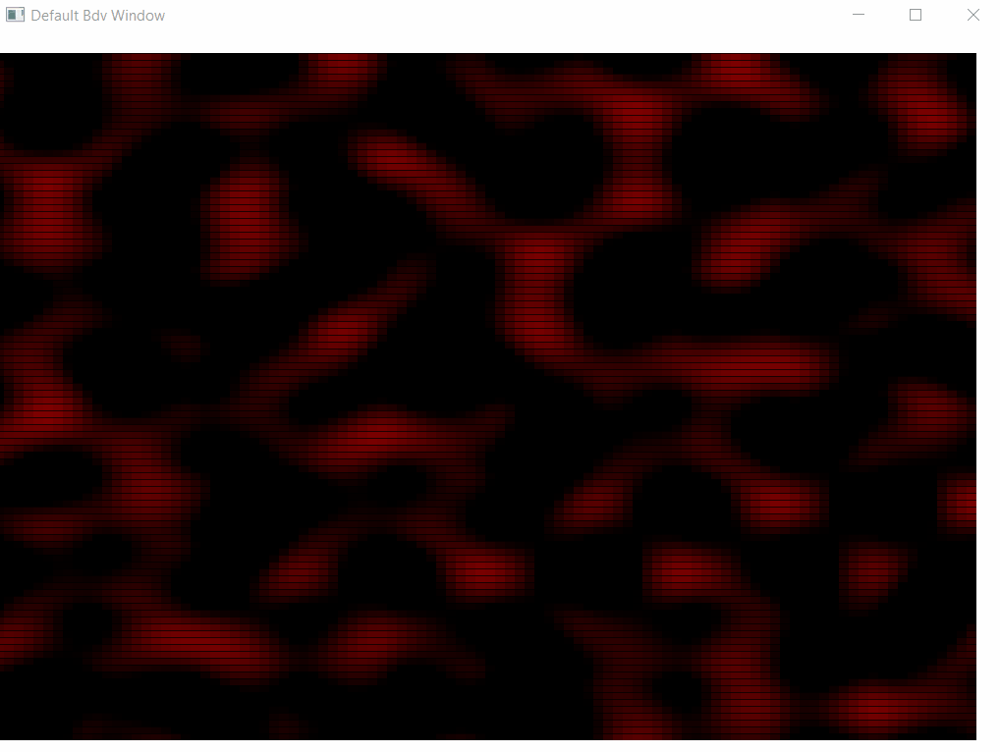
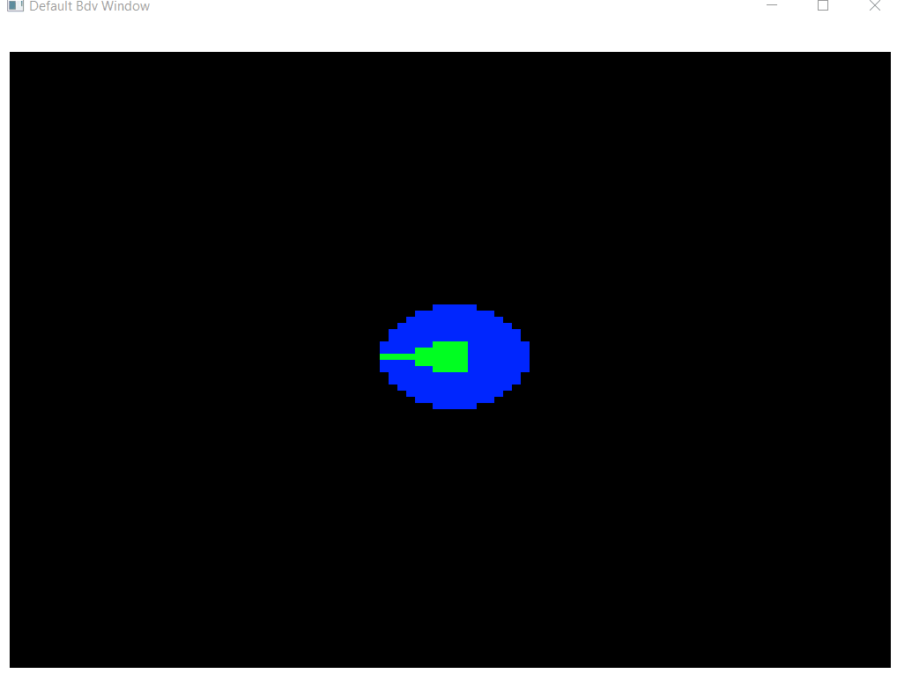

# bdv-engine

## Table of contents
* [Information](#general-info)
* [Cool stuff made using this](#samples)
* [Technologies](#technologies)
* [Demo](#setup)

## General info
This is a project where I migrate most of the graphical stuff that I've been working on with Javascript and WebGL to an actual game engine layer that implements the OpenGL 3.2 API (2D and 3D) bindings through LWJGL3 and GLFW. In such, the user would not be required to actually write shaders but instead interact with my API to actually load data into the rendering pipeline. While this is surely slower than actually buffering the GPU directly, it surely is easier to prototype. It also contains an optional rendering option through Java Swing.

## Samples
Samples I made with this engine includes:

- Terrain generation (2D and 3D)
- Perlin noise
- Mandelbrot sets
- Dijkstra and A* pathfinding implementations
- I still intend to implment ray-casting, 2D lighting and raycasting, 2D ray marching, fluid simulation and a game maybe? :D

















	
## Technologies
Project is created with:
* Java (>=1.8)
* lwjgl-2.9.3
	
## Setup
Simply import the .jar contained in `out/artifacts/bdv_engine_java_jar` and add the lwjgl dll's as native libraries. (The dll's can be found on LWJGL's site or inside `lib/natives`)
Below there is a quick example of a simple texture grid (2D) being loaded into the screen using OpenGL and Swing. You can find many more examples of usage in `src/examples`

## OpenGL rendering API
```
package examples;

import engine.api.BdvScriptGL;
import engine.api.EntityAPI;
import engine.Bdv;
import engine.entities.Camera2D;
import engine.math.*;
import org.lwjgl.util.vector.Vector2f;
import org.lwjgl.util.vector.Vector3f;

import java.io.File;
import java.util.ArrayList;
import java.util.List;
import java.util.logging.Level;
import java.util.logging.Logger;

public class GL_TEST_GRID extends BdvScriptGL {

    private static final Logger LOGGER = Logger.getLogger(GL_TEST_GRID.class.getName());
    private static final String GRASS_TEXTURE_FILE_PATH = new File("src/examples/res/grass2").getAbsolutePath();

    public GL_TEST_GRID() {
        this.camera2d = new Camera2D();
        this.entities = new ArrayList<>();
        this.resolution = new Dimension(1024, 768);
        this.background = new RGBAf(0,0,0,255);
        this.init(this.entities, this.resolution, this.background);
    }

    @Override
    public void init(List<EntityAPI> entities, Dimension resolution, RGBAf background) {
        // In OpenGL, the default viewport sets the origin (0,0,0) at the center of the screen
        int rows = 12;
        int cols = 12;
        Dimension tileSize = new Dimension(this.resolution.width / rows, this.resolution.height / cols);
        for (int i = -rows / 2; i < rows / 2; i++) {
            for (int j = -cols / 2; j < cols / 2; j++) {
                this.entities.add(new EntityAPI(GRASS_TEXTURE_FILE_PATH, new Vector3f(tileSize.width * i, tileSize.height * j, 0), new Vector2f(0, 0)));
            }
        }
    }

    @Override
    public void update() {
    }

    public static void main(String[] args) {
        try {
            new Bdv(GL_TEST_GRID.class);
        } catch (Exception exception) {
            LOGGER.log(Level.SEVERE, exception.toString(), exception);
        }
    }
}
```

## Java Swing rendering API

```
package examples;

import engine.api.BdvScript;
import engine.Bdv;
import engine.core.interfaces.Entity;
import engine.math.Dimension;
import engine.math.RGBA;
import engine.math.Vector2f;
import engine.math.Vector3f;

import java.util.ArrayList;
import java.util.List;
import java.util.logging.Level;
import java.util.logging.Logger;

public class GRID_TEMPLATE extends BdvScript {

    private static final Logger LOGGER = Logger.getLogger(GRID_TEMPLATE.class.getName());

    public GRID_TEMPLATE() {
        this.entities = new ArrayList<>();
        this.resolution = new Dimension(800, 600);
        this.background = new RGBA(255, 20, 147, 255);
        this.windowTitle = "GRID";
        this.init(entities, resolution, background);
    }

    @Override
    public void init(List<Entity> entities, Dimension resolution, RGBA background) {
        int rows = 10;
        int cols = 10;
        Dimension tileSize = new Dimension(this.resolution.width / rows, this.resolution.height / cols);
        for (int i = 0; i < rows; i++) {
            for (int j = 0; j < cols; j++) {
                this.entities.add(new Entity(new Vector3f(tileSize.width * i + i, tileSize.height * j + j),
                        new Vector2f(0f, 0f), tileSize, new RGBA(133, 133, 133, 255)));
            }
        }
    }

    @Override
    public void update() {

    }

    public static void main(String[] args) {
        try {
            new Bdv(GRID_TEMPLATE.class);
        } catch (Exception exception) {
            LOGGER.log(Level.SEVERE, exception.toString(), exception);
        }
    }
}
```
